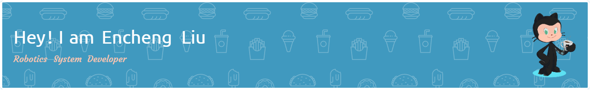

  

---

### ⚡️ A quick introduction

- 🌱 I’m currently learning about Sensor Fusion. 
- 🤟🏻 I love learning new things until I achieve proficiency. Sometimes it's a sport (biking ...), sometimes it's a hobby (cooking, photography, riding on a circuit...), and at times, it's another OpenSource path (Desktop Robot, Mini Monitor...).
---

### My Skills
<!--   my-skills -->

| Property                                        | Data                                                                                                                                                                                                                                                                                                                                                                                                                                                                                                                                                                                                                                                                                                                                                                                                                                                                                                                                                                                                                                                                                                                                                                                                                                                                                                                                                                                                                                                                                                                                                                                                                                                                                                                                                                                                                                                                                                                                                                  |
|-------------------------------------------------|-----------------------------------------------------------------------------------------------------------------------------------------------------------------------------------------------------------------------------------------------------------------------------------------------------------------------------------------------------------------------------------------------------------------------------------------------------------------------------------------------------------------------------------------------------------------------------------------------------------------------------------------------------------------------------------------------------------------------------------------------------------------------------------------------------------------------------------------------------------------------------------------------------------------------------------------------------------------------------------------------------------------------------------------------------------------------------------------------------------------------------------------------------------------------------------------------------------------------------------------------------------------------------------------------------------------------------------------------------------------------------------------------------------------------------------------------------------------------------------------------------------------------------------------------------------------------------------------------------------------------------------------------------------------------------------------------------------------------------------------------------------------------------------------------------------------------------------------------------------------------------------------------------------------------------------------------------------------------|
| **Language / IDE**                              |       |
| **Domain Knowledge**                            |      |
| **CI / CD**                                     |        |
| **Communication**                                      |      | 

![Metrics](https://metrics.lecoq.io/EnchengLiu?template=classic&languages=1&isocalendar=1&lines=1&habits=1&achievements=1&introduction=1&leetcode=1&base=header%2C%20activity%2C%20community%2C%20repositories%2C%20metadata&base.indepth=false&base.hireable=false&base.skip=false&isocalendar=false&isocalendar.duration=full-year&languages=false&languages.limit=8&languages.threshold=0%25&languages.other=false&languages.colors=github&languages.sections=most-used&languages.indepth=false&languages.analysis.timeout=15&languages.analysis.timeout.repositories=7.5&languages.categories=markup%2C%20programming&languages.recent.categories=markup%2C%20programming&languages.recent.load=300&languages.recent.days=14&lines=false&lines.sections=base&lines.repositories.limit=4&lines.history.limit=1&lines.delay=0&habits=false&habits.from=200&habits.days=14&habits.facts=true&habits.charts=false&habits.charts.type=classic&habits.trim=false&habits.languages.limit=8&habits.languages.threshold=0%25&achievements=false&achievements.threshold=C&achievements.secrets=true&achievements.display=detailed&achievements.limit=0&introduction=false&introduction.title=true&leetcode=false&leetcode.user=.user.login&leetcode.sections=solved&leetcode.limit.skills=10&leetcode.limit.recent=2&config.timezone=America%2FLos_Angeles)

